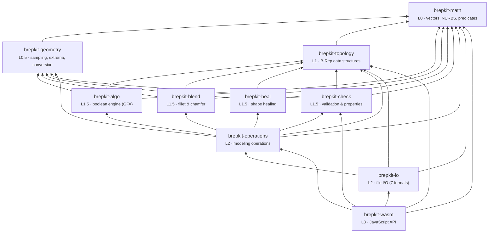

# brepkit

Solid modeling kernel for Rust and WebAssembly.

[](https://github.com/andymai/brepkit/actions/workflows/ci.yml)
[](https://www.npmjs.com/package/brepkit-wasm)
[](#license)
[](https://www.rust-lang.org/) [](https://github.com/rust-secure-code/safety-dance/)
[](https://hypercommit.com/brepkit)

**[Architecture](#architecture)** · **[Performance](#performance)** · **[Getting Started](#getting-started)** · **[Contributing](./CONTRIBUTING.md)**

```rust
use brepkit_operations::primitives::{make_box, make_cylinder};
use brepkit_operations::boolean::{boolean, BooleanOp};
use brepkit_operations::measure::solid_volume;
use brepkit_io::step::writer::write_step;
use brepkit_topology::Topology;

let mut topo = Topology::new();

// Create a block with a cylindrical hole
let block = make_box(&mut topo, 30.0, 20.0, 10.0)?;
let hole = make_cylinder(&mut topo, 5.0, 15.0)?;
let drilled = boolean(&mut topo, BooleanOp::Cut, block, hole)?;

// Measure and export
let vol = solid_volume(&topo, drilled, 0.1)?;
let step = write_step(&topo, &[drilled])?;
```

## Why build a CAD kernel?

brepkit is a from-scratch B-Rep kernel in Rust targeting WebAssembly. `unsafe` is forbidden, `unwrap` and `panic` are denied by default. Every public operation returns `Result`.

The project grew out of building [gridfinitylayouttool.com](https://gridfinitylayouttool.com), where the existing options for parametric CAD in the browser were proprietary or compiled from C++.

## Status

brepkit is in active development. Core modeling works. Some areas are still maturing.

| Category | Feature | Status |
|----------|---------|--------|
| **Primitives** | Box, cylinder, cone, sphere, torus | Stable |
| **Booleans** | Union, cut, intersect (plane, cylinder, cone, sphere, NURBS) | Stable |
| **Booleans** | Torus surface booleans | Planned |
| **Modifiers** | Fillet (constant + variable radius), chamfer, shell, draft | Stable |
| **Modifiers** | Offset face, offset solid, thicken, mirror, pattern | Stable |
| **Sweeps** | Extrude (planar + NURBS profiles) | Stable |
| **Sweeps** | Revolve, sweep, loft, pipe (planar profiles only) | Stable |
| **Sweeps** | Non-planar profiles for revolve, sweep, loft, pipe | Planned |
| **Sectioning** | Cross-section curves, split by plane or surface | Stable |
| **Measurement** | BBox, area, volume, center of mass, inertia tensor | Stable |
| **Measurement** | Point-to-solid, solid-to-solid distance, point classification | Stable |
| **Geometry** | NURBS evaluation, derivatives, knot ops, fitting, projection | Stable |
| **Geometry** | Analytic surface intersections (plane, cylinder, cone, sphere) | Stable |
| **Geometry** | Curve-curve intersection (Bezier clipping) | Stable |
| **Tessellation** | Adaptive deflection, CDT, analytic surface optimization | Stable |
| **Repair** | Shape healing (30+ wire/face/shell fixes), sewing, validation | Stable |
| **I/O** | STEP AP203 import/export (geometry-preserving round-trip) | Stable |
| **I/O** | STL, 3MF, OBJ, PLY, glTF import/export | Stable |
| **I/O** | IGES import/export | Beta |
| **Sketching** | 2D constraint solver | Beta |
| **Feature Recognition** | Holes, pockets, slots, bosses, ribs | Beta |
| **Assemblies** | Hierarchical structure, transforms, BOM | Beta |
| **Evolution** | Face provenance tracking through operations | Beta |
| **Defeaturing** | Remove specified faces/features from solid | Beta |

## Roadmap

Broad directions, no dates.

- **Boolean completeness** — extend the unified General Fuse pipeline to all surface types including torus
- **Sweep generalization** — non-planar profile support for revolve, sweep, loft, and pipe
- **Parallel tessellation** — per-face parallel meshing for large models
- **Assembly metadata** — colors, layers, materials, and PMI for richer data exchange
- **Expanded I/O** — lossless IGES round-trips and broader STEP entity coverage
- **Documentation** — API reference, tutorials, and architectural guides

## Architecture

Layered Cargo workspace. Crates depend only on the same or lower layers. Boundaries are enforced by CI.



| Layer | Crate | What it does |
|-------|-------|-------------|
| L0 | `brepkit-math` | Points, vectors, matrices, NURBS curves/surfaces, geometric predicates, CDT, convex hull |
| L0.5 | `brepkit-geometry` | Curve sampling (uniform, deflection, arc-length, curvature), extrema, analytic-to-NURBS conversion |
| L1 | `brepkit-topology` | Arena-allocated B-Rep: vertex, edge, wire, face, shell, solid. Half-edge adjacency graph |
| L1.5 | `brepkit-algo` | General Fuse Algorithm (GFA) boolean engine: pave filler, face classification, solid assembly |
| L1.5 | `brepkit-blend` | Walking-based fillet and chamfer with constant, variable, and custom radius laws |
| L1.5 | `brepkit-heal` | Shape healing: 30+ fixes, analysis, sewing, tolerance management, configurable pipeline |
| L1.5 | `brepkit-check` | Point classification, validation (17 checks), properties (volume/area/CoM), distance queries |
| L2 | `brepkit-operations` | Booleans, fillet, chamfer, extrude, revolve, sweep, loft, shell, offset, measure, tessellation |
| L2 | `brepkit-io` | Import/export: STEP, IGES, STL, 3MF, OBJ, PLY, glTF |
| L3 | `brepkit-wasm` | JavaScript API via wasm-bindgen with batch execution and checkpoint/restore |

## Performance

Median times from the [brepjs benchmark suite](https://github.com/andymai/brepjs/tree/main/benchmarks) (5 iterations, Node.js, Linux x86_64). WASM is single-threaded; native benchmarks use criterion.

| Operation | brepkit (WASM) | OCCT (WASM) | Speedup | brepkit (native) |
|-----------|---------------|-------------|---------|-----------------|
| fuse(box, box) | 5.7 ms | 83.7 ms | 15x | 336 µs |
| cut(box, cylinder) | 4.2 ms | 123.8 ms | 29x | 221 µs |
| intersect(box, sphere) | 31.9 ms | 107.1 ms | 3.4x | 2.4 ms |
| box + chamfer | 0.1 ms | 7.8 ms | 78x | 55 µs |
| box + fillet | 0.3 ms | 8.1 ms | 27x | 75 µs |
| multi-boolean (16 holes) | 1.7 ms | 52.0 ms | 31x | 1.2 ms |
| mesh sphere (tol=0.01) | 20.0 ms | 61.3 ms | 3.1x | 1.8 ms |
| exportSTEP (×10) | 0.9 ms | 19.2 ms | 21x | — |

Booleans preserve analytic surfaces, keeping face counts low (72 vs ~7,000 for a 9-step compound boolean).

> OCCT comparison uses [opencascade.js](https://github.com/donalffons/opencascade.js) compiled via Emscripten. Both kernels run single-threaded in Node.js. Native benchmarks: `cargo bench -p brepkit-operations`. Full benchmark source: [brepjs/benchmarks](https://github.com/andymai/brepjs/tree/main/benchmarks).

## Data Exchange

| Format | Type | Import | Export |
|--------|------|--------|--------|
| STEP AP203 | B-Rep | ✓ | ✓ |
| IGES | B-Rep | ✓ | ✓* |
| STL | Mesh | ✓ | ✓ |
| 3MF | Mesh | ✓ | ✓ |
| OBJ | Mesh | ✓ | ✓ |
| PLY | Mesh | ✓ | ✓ |
| glTF | Mesh | ✓ | ✓ |

STEP preserves exact geometry on round-trip. *IGES export converts analytic surfaces to NURBS. Mesh formats export tessellated triangles.

## Getting Started

### As a Rust dependency

Not yet published to crates.io. Use git dependencies for now:

```toml
[dependencies]
brepkit-math = { git = "https://github.com/andymai/brepkit" }
brepkit-topology = { git = "https://github.com/andymai/brepkit" }
brepkit-operations = { git = "https://github.com/andymai/brepkit" }
brepkit-io = { git = "https://github.com/andymai/brepkit" }        # optional
```

### As a WASM package

```bash
npm install brepkit-wasm
```

```js
import init, { BrepKernel } from "brepkit-wasm";

await init();
const kernel = new BrepKernel();
const solid = kernel.makeBox(10, 20, 30);
```

For a higher-level TypeScript API, see [brepjs](https://github.com/andymai/brepjs).

### Building from source

```bash
cargo build --workspace
cargo test --workspace
cargo clippy --all-targets -- -D warnings
cargo fmt --all

# WASM (full)
cargo build -p brepkit-wasm --target wasm32-unknown-unknown --release

# WASM (smaller, no IO)
cargo build -p brepkit-wasm --target wasm32-unknown-unknown --release --no-default-features

# Generate API docs
cargo doc --workspace --no-deps --open
```

## Projects Using brepkit

- [brepjs](https://github.com/andymai/brepjs) — CAD modeling for JavaScript
- [Gridfinity Layout Tool](https://github.com/andymai/gridfinity-layout-tool) — Web-based Gridfinity storage layout generator

[Open a PR](https://github.com/andymai/brepkit/pulls) to add your project.

## License

Licensed under either of

- [Apache License, Version 2.0](./LICENSE-APACHE)
- [MIT License](./LICENSE-MIT)

at your option.
