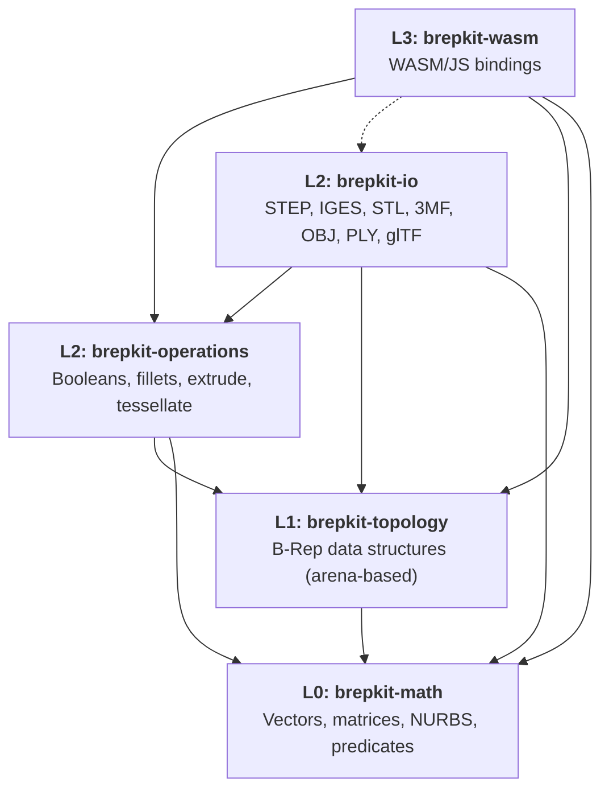

# brepkit

The B-Rep modeling engine behind [brepjs](https://github.com/andymai/brepjs), written in Rust and compiled to WebAssembly.

## Overview

Boundary Representation (B-Rep) modeling describes 3D solids by their boundary surfaces — faces, edges, and vertices — rather than as triangle meshes or voxel grids. This is the standard representation used by professional CAD systems because it preserves exact geometry and supports precise operations like filleting and boolean cuts.

brepkit is the computational backend that powers brepjs. It handles NURBS geometry, boolean operations, filleting, tessellation, and multi-format data exchange in memory-safe Rust with first-class WASM support. brepjs provides the developer-facing TypeScript API; brepkit provides the engine underneath.

## Architecture

brepkit is organized as a layered Cargo workspace. Each layer depends on layers below it; the L2 IO crate also depends on L2 operations for tessellation during export:



| Layer | Crate | Purpose |
|-------|-------|---------|
| L0 | `brepkit-math` | Vectors, matrices, NURBS curves/surfaces, geometric predicates |
| L1 | `brepkit-topology` | B-Rep data structures — vertex, edge, wire, face, shell, solid |
| L2 | `brepkit-operations` | Boolean ops, fillets, extrusion, tessellation, and more |
| L2 | `brepkit-io` | Multi-format CAD data exchange (7 formats) |
| L3 | `brepkit-wasm` | WebAssembly bindings via wasm-bindgen |

## Features

### Primitives

- Box, cylinder, cone, sphere, torus

### Boolean Operations

- Union, cut (subtract), intersection
- Mesh-based boolean (co-refinement)
- NURBS-based boolean

### Shape Modifications

- Extrude, revolve, sweep, loft, pipe
- Helical sweep
- Chamfer, fillet
- Shell (hollow solid), draft (taper faces)
- Offset face, offset solid, offset wire
- Thicken, mirror, pattern (linear/circular)
- Transform (translate/rotate/scale), copy

### Sectioning & Splitting

- Section (cross-section curves)
- Split (divide solid by plane/surface)

### Analysis & Measurement

- Bounding box, area, volume, center of mass
- Point-to-shape distance queries
- Point classification (inside/on/outside solid)
- Feature recognition

### Geometry

- NURBS curve and surface evaluation
- Surface-surface intersection
- Analytic surfaces (cylinder, cone, sphere, torus)
- Curve fitting (LSPIA), point projection
- Self-intersection detection

### Tessellation

- B-Rep to triangle mesh conversion
- CDT (constrained Delaunay) for NURBS faces, snap tessellation for analytic faces

### Repair & Utilities

- Shape healing, defeaturing
- Sewing (join faces into shells)
- Topology validation
- Face filling (Coons patch)
- 2D sketch constraint solver
- Assembly management

## Data Exchange

**B-Rep formats** — import and export exact solid geometry (faces, edges, NURBS):

| Format | Import | Export |
|--------|--------|--------|
| STEP   | ✓      | ✓      |
| IGES   | ✓      | ✓      |

**Mesh formats** — import and export tessellated triangle meshes:

| Format | Import | Export |
|--------|--------|--------|
| STL    | ✓      | ✓      |
| 3MF    | ✓      | ✓      |
| OBJ    | ✓      | ✓      |
| PLY    | ✓      | ✓      |
| glTF   | ✓      | ✓      |

## Getting Started

### npm (JavaScript / TypeScript)

```bash
npm install brepkit-wasm
```

```js
import init, { BrepKernel } from "brepkit-wasm";

await init();
const kernel = new BrepKernel();
const box = kernel.makeBox(10, 20, 30);
```

### Building from source

```bash
# Build all crates
cargo build --workspace

# Run tests
cargo test --workspace

# Lint
cargo clippy --all-targets -- -D warnings

# Build WASM bindings
cargo build -p brepkit-wasm --target wasm32-unknown-unknown

# Build WASM (release, without IO for smaller binary)
cargo build -p brepkit-wasm --target wasm32-unknown-unknown --release --no-default-features
```

## License

Apache-2.0
